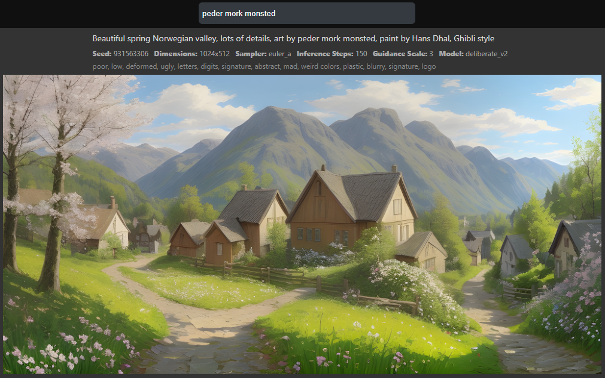

# EasyDiffusion_Image_Browser

Browse and view all images generated and stored by Easy Diffusion

## EasyDiffusion configuration

- Need [EasyDiffusion](https://easydiffusion.github.io/) installed to generate images
- Easy Diffusion > settings
  - Need to activate `Auto-Save Images`
  - Need to set `Metadata format` to `json` *very important, no other format supper yet*

## Use

1) Place this repo **inside the destination repository of EasyDiffusion** (Easy Diffusion > Settings tab > 
`Save Location` path)
2) Start server and client either with `start.bat` file (windows), else, process all the commands of the batch file
3) Open [client](http://localhost:3000/webapp/) and browse pictures

## Client preview

## How does it work

The node.js server `server.js` list all images in jpeg format and metada in json format it found and build an internal JSON list of all images. Then it wait for a GET request `/ai` with query params `q=SomeURLEncodedStringRequest`. The string passed in query params is the user search, separated with spaces. The server filter images and provide all images with their metadata including in prompt all words asked by user.

## To do

- Accept all other metadata formats
- More filter for browsing images
  - Select model
  - Select samplers
  - Select range for inferance steps
  - Select range for guidance scale
  - Select range for dimensions